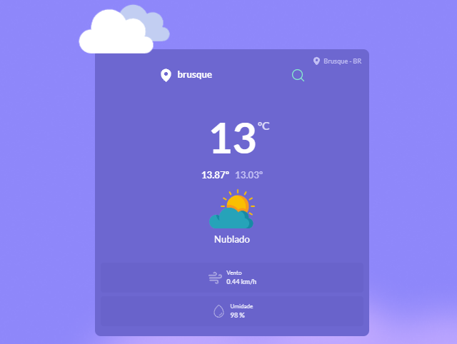

  

## 🚀 Pesquise uma localização

  

## 🚀 Card com as informações

  

## 🚀 Preview

https://github.com/Leorrc/clima-tempo/assets/100796907/2684f2c2-6f36-49ef-9fe7-c1a2ae3011ae

  <a href="#-tecnologias">Tecnologias</a>&nbsp;&nbsp;&nbsp;|&nbsp;&nbsp;&nbsp;
  <a href="#-projeto">Projeto</a>

 

## 🚀 Tecnologias

Esse projeto foi desenvolvido com as seguintes tecnologias:

- [ReactJS](https://reactjs.org/)
- [Vite](https://vitejs.dev/)
- [Typescript](https://www.typescriptlang.org/)
- [TailwindCSS](https://tailwindcss.com/)
- [React-Hook-Form](https://react-hook-form.com/)
- [Zod](https://zod.dev/)
- [Axios](https://axios-http.com/ptbr/docs/intro)
- [React-Toastify](https://fkhadra.github.io/react-toastify/introduction)
- [OpenWeather-API](https://openweathermap.org/api)

## 💻 Projeto

Neste projeto utilizei a [OpenWeather-API](https://openweathermap.org/api) que busca e exibe informações climáticas atualizadas de diferentes lugares. Com uma interface intuitiva, os usuários podem pesquisar qualquer localidade e obter dados como temperatura, umidade, ventos e previsão atual do local.

**Input de search com validações feita com o ZOD**:

- [x] O campo de endereço não pode estar vazio;
- [x] O input aceita apenas letras e hífens;
  - 1 - Caso insira um endereço inexistente, aparecerá uma notificação na tela avisando o erro da pesquisa.
  - 2 - O nome precisa ter pelo menos 3 letras.

 

## 👨🏻‍💻 Funcionalidades

- Preview em tempo real
- Modo tela cheia
- Multiplataforma

## 🚀 Autor

- [Leonardo Carvalho](https://www.linkedin.com/in/leocarvalhodev/)

Made with 💜 &nbsp;by Leonardo Carvalho 👋 &nbsp;[See my linkedin](https://www.linkedin.com/in/leocarvalhodev/)
